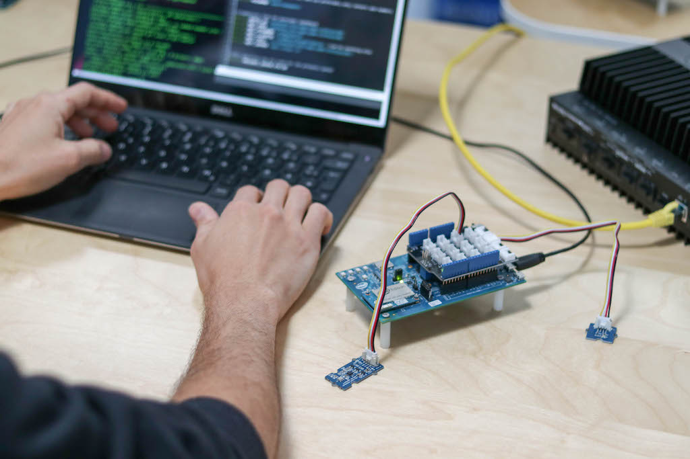
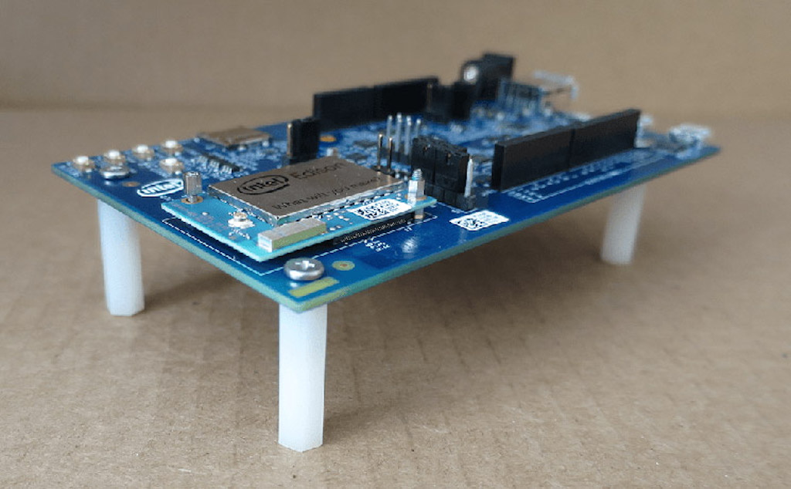
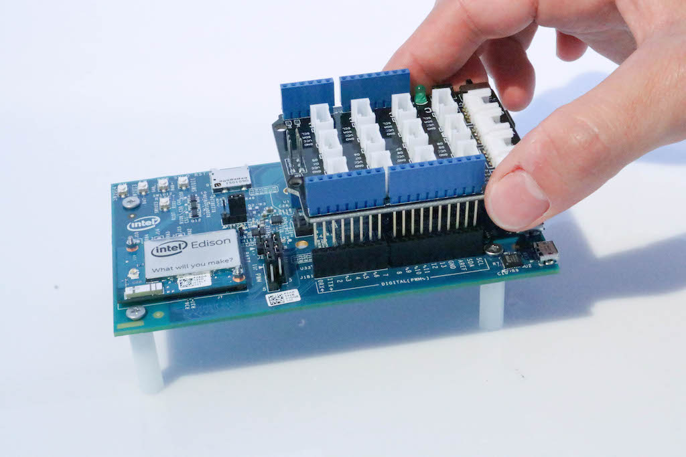

# Intel® Edison and the IoT Acceleration Starter Kit

## Introduction

The [Intel® Edison](http://www.intel.com/content/www/us/en/do-it-yourself/edison.html) is a single-board computer with a Silvermont dual-core
Intel Atom CPU, integrating WiFi, Bluetooth 4.0, 1 GB DDR, 4 GB eMMC flash
memory and USB controllers. The 40 multiplexed GPIO pins, high computing power
and connectivity capabilities allow rapid industrial IoT and fog computing
prototyping.

In this repository, you will find tutorials and code examples of how to make
use of the Edison as a sensor node with the [IoT Acceleration Starter
Kit](http://www.iot-starterkit.de/), using two languages: Python and Arduino.



This document provides resources on how to get started with the Edison,
including the mechanical assembly. **If your board has already been assembled,
then please navigate to one of the available tutorials to continue:**

-  [Python](https://github.com/relayr/edison/tree/master/python)
-  [Arduino](https://github.com/relayr/edison/tree/master/arduino)

## Requirements

The following hardware is required:

-  [Dell Edge Gateway 5100]()
-  [Intel® Edison Arduino Breakout Kit]()

A computer is required to connect the Edison board for flashing and
configuration.

**NOTE:** The additional hardware required for the code examples is specified the Arduino and Python tutorials. All necessary parts are included in the [IoT Acceleration Starter Kit](http://www.iot-starterkit.de/).

## Installation & Configuration

### Setting Up the Hardware

Assemble the Arduino Expansion Board found in your Dell Starter Kit according
to the directions in the [Intel® Edison guide](https://software.intel.com/en-us/node/628221).

Before continuing, make sure that your board looks like this:



After that, plug the Grove Base Shield onto your Arduino Expansion Board as shown below, and you'll be ready to go:



### Setting Up the Software

Once our board is ready, it's time to configure the software of the Edison
according to the programming language of your choice. **Before proceeding with
the Vertex integration,** select one of the following tutorials, and
complete all the steps:

-  [Python](https://github.com/relayr/edison/tree/master/python)
-  [Arduino](https://github.com/relayr/edison/tree/master/arduino)

## Association with Vertex

**NOTE:** This documentation will not be necessary when using the Vertex
dashboard, since this process is implemented automatically. This section
describes the required manual process until the dashboard is ready for
release.

In order to associate your device with Vertex, you must first set up the
Edison software according to the programming language of your choice. We'll
come back to this section later!

First, select one of the available languages mentioned above and follow the
instructions in the linked tutorial. When finished, you can associate the
device with Vertex. This section explains how to do that, as well as where to
find the required parameters to introduce in the code examples.

### Create a Device In the Developer Dashboard

The very first step in order to try the examples is to create a device on the relayr platform. Note that **if you already did this for the code examples, it's not necessary to do it again!**

If not, log in to the [Developer Dashboard](https://dev.relayr.io)
and follow the instructions of [this tutorial](http://docs.relayr.io/getting-started/devices-guide/#introduction).

**NOTE:** You must log in to the account where Vertex has been onboarded.
All devices that will be associated with Vertex must be on the same account as
Vertex itself.

### Parameters

The following parameters are required in order to associate the device with Vertex:

-  `Vertex Id`: UUID of your Vertex gateway. Once you're done with the section ["Configuration & Onboarding"](https://github.com/relayr/vertex/blob/master/docs/vertex_DSK_readme.md#configuration--onboarding), the gateway should show up as another device. This UUID simply corresponds to the "device ID" of the gateway, that can be displayed as described [here](http://docs.relayr.io/getting-started/devices-guide/#editing--deleting-a-device).
-  `Authorization Token`: A token that authorizes you to make API calls to your user account and - evices that you manage. [Here is more info about it](http://docs.relayr.io/getting-started/account-creation/#user-id-and-authorization-token) and where to retrieve it.
-  `Device Id`: UUID of the device that will be associated with Vertex. Provided by the relayr - latform [when adding a device](http://docs.relayr.io/getting-started/devices-guide/).
-  `User`: MQTT user, in this case the same as the `Device Id`.
-  `Password`: MQTT password. Provided by the relayr platform [when adding a device](http://docs.relayr.io/getting-started/devices-guide/).
-  `MQTT Server Hostname`: The IP address of your Vertex gateway. This is not specifically required in this step, but it will be added into the code examples. For more information, please refer to the step #8 of the section ["Configuration & Onboarding"](https://github.com/relayr/vertex/blob/master/docs/vertex_DSK_readme.md#configuration--onboarding) as described on the Vertex documentation.

### Using cURL

Open the terminal (or CLI), fill in the variables in the request shown below
with your own parameters, and press enter:

```
curl -H "Content-Type: application/json" -H "Authorization: Bearer {your Authorization Token}" -X POST -d '{"deviceId": "{your Device Id}","transport": "mqtt","credentials": {"user": "{your Device Id}","password": "{your Password}"},"configuration": {}}' http://prod-vertex.relayr.io:8081/vertices/{your Vertex Id}/devices
```

### Using Postman

The POST request to associate your device with Vertex can also be done using
Postman. If you are not familiar with Postman, you may have a look at [this
tutorial](https://www.getpostman.com/docs/requests).

Fill in the following parameters to make the request:

**POST URL:**
`http://prod-vertex.relayr.io:8081/vertices/{your Vertex Id}/devices`

**Headers:**

-  `Authorization: Bearer {your Authorization Token}`
-  `Content-Type: application/json`

**Body:**

```
{
  "deviceId": "{your Device Id}",
  "transport": "mqtt",
  "credentials": {
    "user": "{your Device Id}",
    "password": "{your Password}"
  },
  "configuration": {}
}

```

## License

Copyright (C) 2016 relayr GmbH, Klemen Lilija <klemen@relayr.io>, Brian Lemke
<brian@relayr.io>, Antonio Almeida <antonio@relayr.io>, Jaime González-Arintero <jaime@relayr.io>

Permission is hereby granted, free of charge, to any person obtaining a copy
of this software and associated documentation files (the "Software"), to deal
in the Software without restriction, including without limitation the rights
to use, copy, modify, merge, publish, distribute, sublicense, and/or sell
copies of the Software, and to permit persons to whom the Software is
furnished to do so, subject to the following conditions:

The above copyright notice and this permission notice shall be included in all
copies or substantial portions of the Software.

Except as contained in this notice, the name(s) of the above copyright holders
shall not be used in advertising or otherwise to promote the sale, use or
other dealings in this Software without prior written authorization.

THE SOFTWARE IS PROVIDED "AS IS," WITHOUT WARRANTY OF ANY KIND, EXPRESS OR
IMPLIED, INCLUDING BUT NOT LIMITED TO THE WARRANTIES OF MERCHANTABILITY,
FITNESS FOR A PARTICULAR PURPOSE AND NONINFRINGEMENT.  IN NO EVENT SHALL THE
AUTHORS OR COPYRIGHT HOLDERS BE LIABLE FOR ANY CLAIM, DAMAGES OR OTHER
LIABILITY, WHETHER IN AN ACTION OF CONTRACT, TORT OR OTHERWISE, ARISING FROM,
OUT OF OR IN CONNECTION WITH THE SOFTWARE OR THE USE OR OTHER DEALINGS IN THE
SOFTWARE.