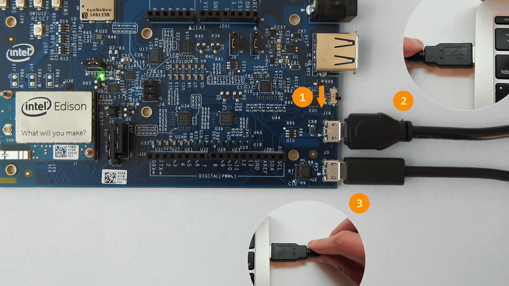
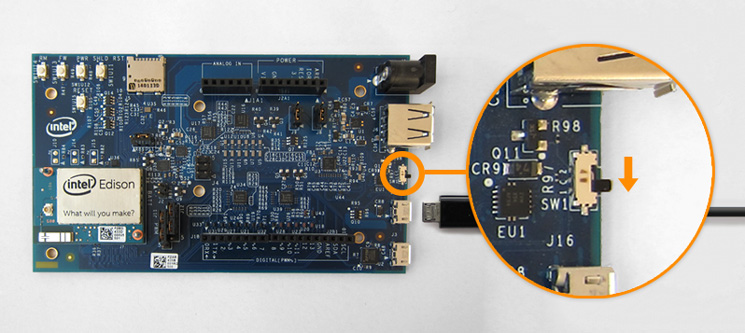
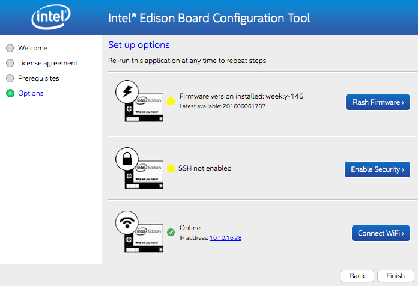

# Intel® Edison and the IoT Acceleration Starter Kit (Arduino Edition)

## Introduction

This document details all the necessary steps required to make use of the
[Intel® Edison](http://www.intel.com/content/www/us/en/do-it-yourself/edison.html) as a sensor node with the [IoT Acceleration Starter
Kit](http://www.iot-starterkit.de/). 

This document refers **only** to using **Arduino** on the Edison. For
information on using Python on the Edison, see the [Python
instructions](https://github.com/relayr/edison/tree/master/python).

## Requirements

The following hardware is required:

 * [Dell Edge Gateway 5100]()
 * [Intel® Edison Arduino Breakout Kit]()
 * [Seedstudio Grove Base Shield v2](http://wiki.seeedstudio.com/wiki/Grove_-_Base_shield_v2)
 * [Seedstudio Sensor Kit]()

A computer is required to connect the Edison board for flashing and configuration.

## Installation & Configuration

### Setting Up the Hardware

Assemble the Arduino Expansion Board found in your Dell Starter Kit according
to the directions in the [Intel® Edison guide](https://software.intel.com/en-us/node/628221).

Before continuing, make sure that your board looks like this:


Image

### Setting Up the Firmware 

Unfortunately, there are known issues with the latest versions of the
Edison firmware that may cause the board to crash when running Arduino
sketches after booting. Therefore, we must first **downgrade the Edison's
firmware:**

1.  First, download a previous version of the firmware. The code examples in this guide have been tested using the **firmware image 146 (ww18-15)**, which you can find [here](https://downloadmirror.intel.com/24910/eng/edison-image-ww18-15.zip).

2.  Unzip the file.

3.  Download and install the Intel® Flash Tool Lite, which will help flash the firmware on to the board. Select the version of your operating system:

	- [Windows (32 and 64-bit)](https://download.01.org/android-ia/tools/platformflashtool-lite/5.5.2.0/PlatformFlashToolLite_5.5.2.0_win32.exe)
	- [Mac OS](https://download.01.org/android-ia/tools/platformflashtool-lite/5.5.2.0/PlatformFlashToolLite_5.5.2.0_mac64.pkg)
	- [Ubuntu](https://download.01.org/android-ia/tools/platformflashtool-lite/5.5.2.0/platformflashtoollite_5.5.2.0_linux_x86_64.deb)
	- [Fedora](https://download.01.org/android-ia/tools/platformflashtool-lite/5.5.2.0/platformflashtoollite_5.5.2.0_linux_x86_64.rpm)

4. Once the tool is installed, connect the board to your computer using both micro USB ports, as shown below:

Should you need additional help on this step, a detailed explanation can be found [here](https://software.intel.com/en-us/flashing-firmware-with-flash-tool-lite#With_Arduino_expansion).

5. Now open Flash Tool Lite and follow the procedure to flash the firmware image you just downloaded, as explained in [this tutorial](https://software.intel.com/en-us/flashing-firmware-with-flash-tool-lite#Flashing_your_board). If the tool has trouble finding your Edison, try disconnecting and reconnecting the micro USB cable marked as #2 in the picture above.

It may take over 5 minutes until the process is complete, so be patient!

### Verifying the Current Firmware Version

Now we'll make sure that the firmware version of your board has been properly
downgraded. We will use the **Intel® Edison Board Configuration Tool** in
order to verify the version and, optionally, to adjust the network
configuration. Follow the setup instructions for your operating
system:

-  [Windows 64-bit](https://software.intel.com/en-us/get-started-edison-windows-step2)
-  [Windows 32-bit](https://software.intel.com/en-us/get-started-edison-windows-32-step2)
-  [Mac OS X](https://software.intel.com/en-us/get-started-edison-osx-step2)
-  [Linux](https://software.intel.com/en-us/get-started-edison-linux-step2)

Once the tool is installed, connect the board to your computer as shown below:
	


**NOTE:** It is recommended to keep the second micro USB port connected all the time to an additional port of the computer, to make sure the Edison has enough current.

Now open the Intel® Edison Board Configuration Tool. The tool interface should
indicate that the firmware version installed corresponds to the 146, like
such:


**NOTE:** Do not click on "Flash Firmware"! Doing so will update the firmware
again to the latest version, which will overwrite the one that we just
installed.

### Configure the WiFi

The Intel® Edison Board Configuration Tool also allows you to configure the WiFi easily. This is required, since our Edison will be sending data wirelessly to the gateway.

Click on "Connect WiFi" and follow the instructions. Select the network that you'll be using during the deployment, so later on the Edison can send data to the gateway. Once you're done and back in the main screen, the tool should indicate that the board is online, displaying the IP address as shown below:



### (Optional) Enable SSH

Another feature this tool offers is configuring the SSH. Although for these code examples it's not required, it may be useful to you in that it provides remote access to your Edison board.

Simply click on "Enable Security," follow the instructions provided by the tool and you'll be ready to go. Once this process is complete, the board can be accessed remotely by using its Linux shell. Again, **this is not required to work with Arduino sketches**, but we'll be detailing the procedure here in case you would like to try.

First we will need the Edison's IP address, which is found in the WiFi section of the Intel® Edison Board Configuration Tool, as seen in the picture of the previous section. Alternatively, we can find the IP address of the board **without** the Intel® configuration wizard by using any of the following methods:

 1. Log in to your router/access point and find the IP address assigned to the Edison board.
 2. Set up [mDNS](http://www.multicastdns.org/) on your Intel Edison.
 3. Set up the board using a **static** IP.
 4. Find the IP address of the board using a scanner such as [`nmap`](https://nmap.org/).

Once we know the IP of the Edison we can execute the following command which will log us in the board using SSH:

```shell
ssh root@<edison's-IP-address>
```

When prompted for a password use the one that was set in the security settings of the Intel® Edison Board Configuration Tool. If everything worked properly, we should now be
logged in to the board as **root**.

### Install and Configure the Arduino IDE

Now the Edison board is ready to run Arduino sketches. Before we can start
working with the examples, though, we must install the Arduino Integrated
Development Environment (IDE) in order to flash sketches on to the board.
[Click here to download the IDE.](https://www.arduino.cc/en/Main/Software)

When the download is complete, open the IDE and navigate to **Tools → Board →
Boards Manager**. On the search bar (with the label "filter your search"),
type "Edison." Only one result should display, including the family of Intel®
i686 boards. Select it, and click on "Install." The boards manager will now
download and install the new package.

### Install the Required Libraries

These code examples require the following libraries. Make sure to add them before getting started. Otherwise you will run into compilation errors!

To start including them, download the following libraries in the links below, and **leave them uncompressed** (as .ZIP files):

* [Arduino Client for MQTT](https://github.com/knolleary/pubsubclient/archive/master.zip): This library provides a client for doing simple publish/subscribe messaging with an MQTT broker.
* [DHT Sensor Library](https://github.com/adafruit/DHT-sensor-library/archive/master.zip): Arduino library for the DHT series of low cost temperature/humidity sensors. Only necessary for the examples involving this type of sensors.

Later on, in the Arduino IDE, navigate to **Sketch → Include Library**. At the top of the drop down list, select the option **Add .ZIP Library**. Now select the libraries from your file manager (one by one), and they will be integrated onto the IDE. To learn more, you may follow [this tutorial](https://www.arduino.cc/en/Guide/Libraries).

Now you are ready to run the code examples below!

## Code Examples

Aside from this tutorial, in this repository you may also find the following code examples that will help you getting started with the different sensors included in the kit. These codes are heavily commented so they can be the base of more complex applications.

### Example 1 (blink.ino)

**NOTE:** This example is standard for Arduino-based devices, and included on the Arduino IDE by default. Thus, it's not included on this repository.

The `blink.ino` example is a *Hello world* code to make sure that everything works as expected, and we're able to flash sketches on our Edison. You may connect the board to your computer using both USB ports and try to run the "blink" example. [Click here for a tutorial on this procedure](https://www.arduino.cc/en/Guide/IntelEdison#toc3).

The script toggles the GPIO 13 output every second. When the sketch is running you'll notice a blinking LED on the Arduino breakout kit connected to the GPIO 13.

If everything works well we can move on to the next example in which we will connect a motion sensor to the Edison board. If after a few seconds the LED is not blinking on your board, you may need to re-flash the firmware image again, as described in the [previous steps](#setting-up-the-firmware).

### Example 2 (motion.ino)

intro, what, how, congrats

### Example 3 (buzzer.ino)

intro, what, how, congrats

### Example 4 (multi_sensor.ino)

## References

## To Do
Add 3rd party licenses of the libraries used for the MQTT communication!

## License

 Copyright (C) 2016 relayr GmbH, Jaime González-Arintero <jaime@relayr.io>

 Permission is hereby granted, free of charge, to any person obtaining a 
 copy of this software and associated documentation files (the "Software"), 
 to deal in the Software without restriction, including without limitation 
 the rights to use, copy, modify, merge, publish, distribute, sublicense, 
 and/or sell copies of the Software, and to permit persons to whom the 
 Software is furnished to do so, subject to the following conditions: 

 The above copyright notice and this permission notice shall be included in 
 all copies or substantial portions of the Software. 

 Except as contained in this notice, the name(s) of the above copyright 
 holders shall not be used in advertising or otherwise to promote the sale, 
 use or other dealings in this Software without prior written authorization. 

 THE SOFTWARE IS PROVIDED "AS IS," WITHOUT WARRANTY OF ANY KIND, EXPRESS OR 
 IMPLIED, INCLUDING BUT NOT LIMITED TO THE WARRANTIES OF MERCHANTABILITY, 
 FITNESS FOR A PARTICULAR PURPOSE AND NONINFRINGEMENT.  IN NO EVENT SHALL 
 THE AUTHORS OR COPYRIGHT HOLDERS BE LIABLE FOR ANY CLAIM, DAMAGES OR OTHER 
 LIABILITY, WHETHER IN AN ACTION OF CONTRACT, TORT OR OTHERWISE, ARISING 
 FROM, OUT OF OR IN CONNECTION WITH THE SOFTWARE OR THE USE OR OTHER 
 DEALINGS IN THE SOFTWARE. 