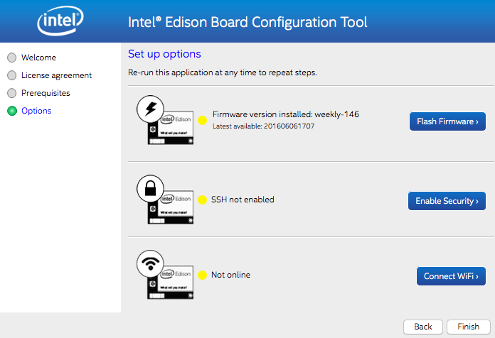

# Intel® Edison and the IoT Acceleration Starter Kit (Arduino Edition)

## Introduction

This document details all the necessary steps required to make use of the
[Intel® Edison](http://www.intel.com/content/www/us/en/do-it-yourself/edison.html) as a sensor node with the [IoT Acceleration Starter
Kit](http://www.iot-starterkit.de/). 

This document refers **only** to using **Arduino** on the Edison. For
information on using Python on the Edison, see the [Python
instructions](https://github.com/relayr/edison/tree/master/python).

## Requirements

The following hardware is required:

 * [Dell Edge Gateway 5100]()
 * [Intel® Edison Arduino breakout kit]()
 * [Seedstudio Grove Base Shield v2](http://wiki.seeedstudio.com/wiki/Grove_-_Base_shield_v2)
 * [Seedstudio sensor kit]()

A computer is required to connect the Edison board for flashing and configuration.

## Installation & Configuration

### Setting Up the Hardware

Assemble the Arduino Expansion Board found in your Dell Starter Kit according
to the directions in the [Intel® Edison guide](https://software.intel.com/en-us/node/628221).

Before continuing, make sure that your board looks like this:

### Setting Up the Firmware 

Unfortunately, there are known issues with the latest versions of the
Edison firmware that may cause the board to crash when running Arduino
sketches after booting. Therefore, we must first **downgrade the Edison's
firmware:**

1.  First, download a previous version of the firmware. The code examples in this guide have been tested using the **firmware image 146 (ww18-15)**, which you can find [here](https://downloadmirror.intel.com/24910/eng/edison-image-ww18-15.zip).
2.  Unzip the file. 
3.  Download and install the Intel® Flash Tool Lite, which will help flash the firmware on to the board. [Click here for information on how to install this tool.](https://software.intel.com/en-us/using-flash-tool-lite)
4.  Open Flash Tool Lite and follow the procedure to flash the firmware image you just downloaded, as explained in [this tutorial](https://software.intel.com/en-us/flashing-firmware-with-flash-tool-lite).

It may take over 5 minutes until the process is complete, so be patient!

### Verifying the Current Firmware Version

Now we'll make sure that the firmware version of your board has been properly
downgraded. We will use the **Intel® Edison Board Configuration Tool** in
order to verify the version and, optionally, to adjust the network
configuration. Follow the setup instructions for your operating
system:

-  [Windows 64-bit](https://software.intel.com/en-us/get-started-edison-windows-step2)
-  [Windows 32-bit](https://software.intel.com/en-us/get-started-edison-windows-32-step2)
-  [Mac OS X](https://software.intel.com/en-us/get-started-edison-osx-step2)
-  [Linux](https://software.intel.com/en-us/get-started-edison-linux-step2)

Once the tool is installed, connect the board to your computer as shown below:
	

Now open the Intel® Edison Board Configuration Tool. The tool interface should
indicate that the firmware version installed corresponds to the 146, like
such:

**NOTE:** Do not click on "Flash Firmware"! Doing so will update the firmware
again to the latest version, which will overwrite the one that we just
installed.

### (Optional) Enable SSH and Configure the WiFi

The Intel® Edison Board Configuration Tool also allows you to enable SSH on
the board and configure the WiFi. These options are not required, but may be
useful to you in that they provide remote access to your Edison board.

Simply follow the instructions provided by the tool and you'll be ready to go.
Once this process is complete, the board can be accessed remotely (e.g. through the
CLI). Although this is not required to work with Arduino sketches, see [this
step](https://github.com/relayr/edison/tree/master/python#connecting-your-personal-computer-with-the-intel-edison) of the Python tutorial, which
describes the procedure.

### Install and Configure the Arduino IDE

Now the Edison board is ready to run Arduino sketches. Before we can start
working with the examples, though, we must install the Arduino Integrated
Development Environment (IDE) in order to flash sketches on to the board.
[Click here to download the IDE.](https://www.arduino.cc/en/Main/Software)

When the download is complete, open the IDE and navigate to **Tools → Board →
Boards Manager**. On the search bar (with the label "filter your search"),
type "Edison." Only one result should display, including the family of Intel®
i686 boards. Select it, and click on "Install." The boards manager will now
download and install the new package.

To make sure that everything works as expected, you may connect the board to
your computer using both USB ports and try to run the "blink" example. [Click
here for a tutorial on this
procedure](https://www.arduino.cc/en/Guide/IntelEdison#toc3).

Now you are ready to run the code examples below!

## Code Examples

Intro for examples clone the repository

### Example 1 (Blink)

intro, what, how, congrats

### Example 2 (PIR Sensor)

intro, what, how, congrats

### Example 3 (Buzzer)

intro, what, how, congrats

## References