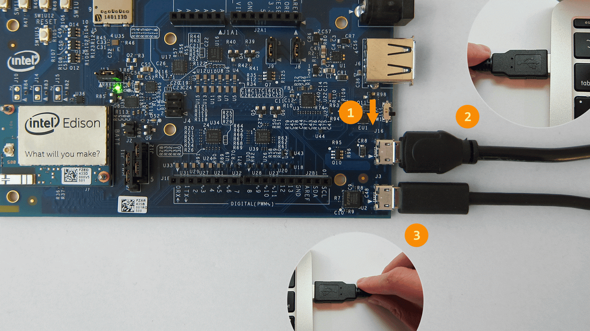
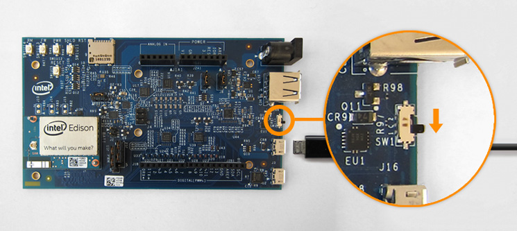
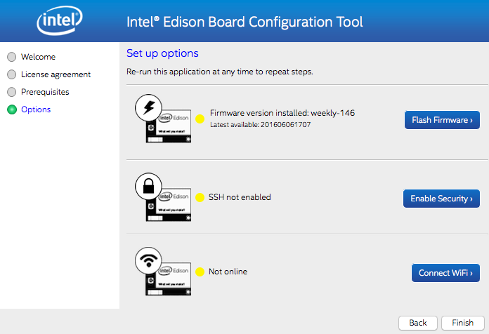
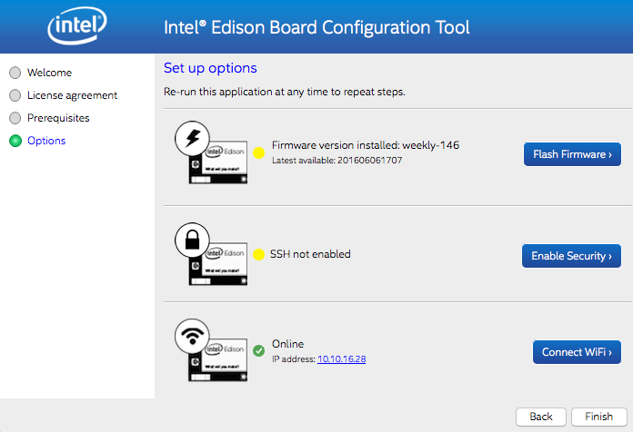
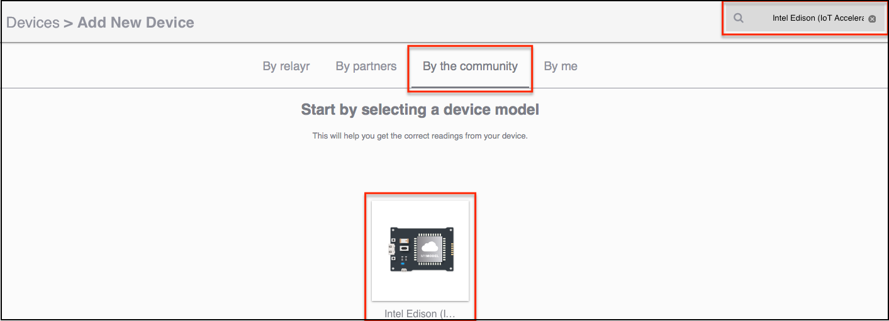
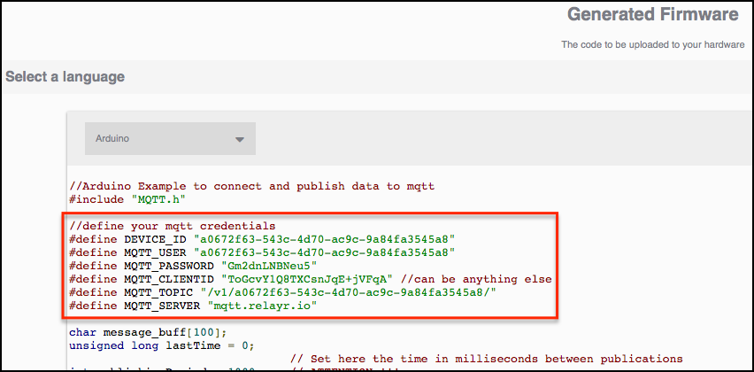

# Intel® Edison and the Industrial IoT Starter Kit (Arduino Edition)

## Introduction

This document details all the necessary steps required to make use of the [Intel® Edison](http://www.intel.com/content/www/us/en/do-it-yourself/edison.html) as a sensor node with the **Industrial IoT Starter Kit**. 

This document refers **only** to using **Arduino** on the Edison. For information on using Python on the Edison, see the [Python instructions](https://github.com/relayr/edison/tree/master/python/README_Industrial_IoT_Starter_Kit.md).

## Requirements

The following hardware is required:

* [Cisco 809 Industrial Integrated Services Router](http://www.cisco.com/c/en/us/products/routers/809-industrial-router/index.html)
* [Intel Edison Arduino breakout kit](https://www.iot-starterkit.de/fileadmin/media/pdf/iot/edisonarduino_hg_331191007_2.pdf)
* [Seeedstudio Grove Base Shield](http://wiki.seeedstudio.com/wiki/Grove_-_Base_shield_v2)
* Seeedstudio Sensor Kit
* Wireless Access Point (that is part of the same local network, so the Edison can connect via WiFi)
* Network Switch (to connect the Cisco 809 and the Wireless Access Point)

A computer is required to connect the Edison board for flashing and configuration.

## Installation & Configuration

### Setting Up the Hardware

Assemble the Arduino Expansion Board found in your Industrial IoT Starter Kit according to the directions in the [Intel® Edison guide](https://software.intel.com/en-us/node/628221).

Before continuing, make sure that your board looks like this:


### Setting Up the Firmware 

Unfortunately, there are known issues with the latest versions of the Edison firmware that may cause the board to crash when running Arduino
sketches after booting. Therefore, we must first **downgrade the Edison's
firmware:**

1.  First, download a previous version of the firmware. The code examples in this guide have been tested using the **firmware image 146 (ww18-15)**, which you can find [here](https://downloadmirror.intel.com/24910/eng/edison-image-ww18-15.zip).

2.  Unzip the file.

3.  Download and install the Intel® Flash Tool Lite, which will help flash the firmware on to the board. Select the version of your operating system:

	- [Windows (32 and 64-bit)](https://download.01.org/android-ia/tools/platformflashtool-lite/5.5.2.0/PlatformFlashToolLite_5.5.2.0_win32.exe)
	- [Mac OS](https://download.01.org/android-ia/tools/platformflashtool-lite/5.5.2.0/PlatformFlashToolLite_5.5.2.0_mac64.pkg)
	- [Ubuntu](https://download.01.org/android-ia/tools/platformflashtool-lite/5.5.2.0/platformflashtoollite_5.5.2.0_linux_x86_64.deb)
	- [Fedora](https://download.01.org/android-ia/tools/platformflashtool-lite/5.5.2.0/platformflashtoollite_5.5.2.0_linux_x86_64.rpm)

4. Once the tool is installed, connect the board to your computer using both micro USB ports, as shown below:

Should you need additional help on this step, a detailed explanation can be found [here](https://software.intel.com/en-us/flashing-firmware-with-flash-tool-lite#With_Arduino_expansion).

5. Now open Flash Tool Lite and follow the procedure to flash the firmware image you just downloaded, as explained in [this tutorial](https://software.intel.com/en-us/flashing-firmware-with-flash-tool-lite#Flashing_your_board). If the tool has trouble finding your Edison, try disconnecting and reconnecting the micro USB cable marked as #2 in the picture above.

It may take over 5 minutes until the process is complete, so be patient!

### Verifying the Current Firmware Version

Now we'll make sure that the firmware version of your board has been properly downgraded. We will use the **Intel® Edison Board Configuration Tool** in order to verify the version and, optionally, to adjust the network configuration. Follow the setup instructions for your operating system:

-  [Windows 64-bit](https://software.intel.com/en-us/get-started-edison-windows-step2)
-  [Windows 32-bit](https://software.intel.com/en-us/get-started-edison-windows-32-step2)
-  [Mac OS X](https://software.intel.com/en-us/get-started-edison-osx-step2)
-  [Linux](https://software.intel.com/en-us/get-started-edison-linux-step2)

Once the tool is installed, connect the board to your computer as shown below:
	


**NOTE:** It is recommended to keep the second micro USB port connected to an additional port of the computer in order to make sure the Edison has enough current.

Now open the Intel® Edison Board Configuration Tool. The tool interface should indicate that the firmware version installed corresponds to the 146, like such:



**NOTE:** Do not click on "Flash Firmware"! Doing so will update the firmware again to the latest version, which will overwrite the one that we just installed.

### Configure the WiFi

The Intel® Edison Board Configuration Tool also allows you to configure the WiFi easily. This is required, since our Edison will be sending data wirelessly to the gateway.

Click on "Connect WiFi" and follow the instructions. Select the network that you'll use during the deployment so that later on the Edison can send data to
the gateway. Once the configuration is complete and you have returned to the main screen, the tool should indicate that the board is online, displaying the IP address as shown below:



### (Optional) Enable SSH

Another feature this tool offers is configuring the SSH. Although SSH is not required for these code examples, it may be useful to you in that it provides
remote access to your Edison board.

Simply click on "Enable Security," follow the instructions provided by the tool and you'll be ready to go. Once this process is complete, the board can
be accessed remotely by using its Linux shell. Again, **this is not required to work with Arduino sketches**, but the procedure is explained here in case you would like to try.

First we will need the Edison's IP address, which is found in the WiFi section of the Intel® Edison Board Configuration Tool, as seen in the picture of the
previous section. Alternatively, we can find the IP address of the board **without** the Intel® configuration wizard by using any of the following
methods:

1.  Log in to your router/access point and find the IP address assigned to the Edison board.
2.  Set up [mDNS](http://www.multicastdns.org/) on your Intel Edison.
3.  Set up the board using a **static** IP.
4.  Find the IP address of the board using a scanner such as [`nmap`](https://nmap.org/).

Once we know the IP of the Edison we can execute the following command which
will log us in the board using SSH:

```shell
ssh root@<edison's-IP-address>
```

When prompted for a password, use the one that was set in the security settings of the Intel® Edison Board Configuration Tool. If everything worked properly, we should now be logged in to the board as **root**.

### Install and Configure the Arduino IDE

Now the Edison board is ready to run Arduino sketches. Before we can start working with the examples, though, we must install the Arduino Integrated
Development Environment (IDE) in order to flash sketches on to the board.
[Click here to download the IDE.](https://www.arduino.cc/en/Main/Software)

When the download is complete, open the IDE and navigate to **`Tools` → `Board` → `Boards Manager`**. On the search bar (with the label "filter your search"), type "Edison." Only one result should display, including the family of Intel®
i686 boards. Select it, and click on "Install." The boards manager will now download and install the new package.

### Install the Required Libraries

These code examples require the following libraries. Make sure to add them before getting started, or else you will run into compilation errors!

To start including them, download the following libraries in the links below, and **leave them uncompressed** (as .ZIP files):

-  [Arduino Client for MQTT](https://github.com/knolleary/pubsubclient/archive/master.zip): This library provides a client for doing simple publish/subscribe messaging with an MQTT broker.
-  [Barometer Sensor Library](https://github.com/Seeed-Studio/Grove_Barometer_Sensor/archive/master.zip): Arduino library for the Bosch BMP085 high-accuracy chip to measure barometric pressure and temperature. This library is compatible as well with the BMP180, integrated in the Grove IMU 10DOF.

Later on, in the Arduino IDE, navigate to **`Sketch` → `Include Library`**. At the top of the drop down list, select the option **`Add .ZIP Library`**. Now select the libraries from your file manager (one by one), and they will be integrated onto the IDE. To learn more, you may follow [this tutorial](https://www.arduino.cc/en/Guide/Libraries).

### Connect the Edison and Configure the Flashing Settings

Make sure that your Edison board is connected to your computer with the micro USB port shown in this picture. It's a fully USB compatible, micro AB, OTG (power “on the go”) port, marked in the board as `J16`. Also, make sure that the tiny switch is in the right position:


After a few seconds, on the Arduino IDE, navigate to **`Tools` → `Board`**, and select the Intel® Edison board.

The next step is to select the right serial port. Go to **`Tools` → `Port`**, and select the port marked as "Intel® Edison" in brackets. If there is no port
with such label, you can always disconnect your Edison, check the available ports, and then reconnect it and check again which port shows up after that,
since that's the one that corresponds to your board. You can also have a look at [this tutorial](https://software.intel.com/en-us/get-started-arduino-blink), which will help you find the right port in different operating systems.

Now you are ready to run the code examples below!

## Code Examples

In this repository, you will also find the following code examples that will help you get started with the different sensors included in the kit. These codes are heavily commented so that they can serve as the base of more complex applications.

We will need a representation of our Intel® Edison board in the relayr Cloud. Through this entity we will manage sent/received data, MQTT credentials and UI interface of the relayr Dashboard. To create a device on relayr Dashboard follow the [**Devices Guide**](http://docs.relayr.io/getting-started/devices-guide/) and select the **Intel Edison (Industrial IoT Starter Kit)** as a *Device Model*. The best way to find this model when creating the device is to select the tab "By the community," and type in the search bar the name of the model: "Intel Edison (Industrial IoT Starter Kit)."



Once you create the device, the relayr Dashboard will generate the MQTT credentials for your device, as shown below:



Now **copy this piece of code** and store it for now. These credentials can be retrieved later, but in a format that must be converted.

### Example 1 (`blink.ino`)

**NOTE:** This example is standard for Arduino-based devices, and included on the Arduino IDE by default. Thus, it's not included on this repository.

The `blink.ino` example is a *Hello world* code sample used to test that
everything works as expected, and that we are able to flash sketches on our
Edison. You may connect the board to your computer using both USB ports and
try to run the "blink" example. [Click here for a tutorial on this
procedure](https://www.arduino.cc/en/Guide/IntelEdison#toc3).

The script toggles the GPIO 13 output every second. While the sketch is running,
you'll notice a blinking LED on the Arduino breakout kit connected to the GPIO
13.

If everything works as intended, we can move on to the next example, in which
we will connect a motion sensor to the Edison board. If the LED on your board
does not start to blink after a few seconds, you may need to re-flash the
firmware image as described in the [previous steps](#setting-up-the-firmware).

### Example 2 (`motion_sensor.ino`)

The `motion_sensor.ino` example uses a PIR motion sensor to detect movement in its proximity. The sensor outputs a digital value (*HIGH* if there is movement, *LOW* if there is no movement) that is then sent to the Vertex-enabled gateway and the relayr cloud.

First, prepare the hardware by connecting the *PIR motion sensor* to the **Digital Pin 2 (D2)**.


Next, open the `motion_sensor.ino` sketch with the Arduino IDE and introduce the SSID and the WiFi network password in the following section towards the beginning of the sketch:

```C++
// WiFi credentials
#define SSID "INTRODUCE_YOUR_SSID_HERE"
#define PASSWORD "INTRODUCE_YOUR_PASSWORD_HERE"
```

Below the WiFi credentials, you will see the MQTT credentials. Fill in these
credentials with the ones generated by the relayr Dashboard during device
creation, which you stored earlier. Change the following part of the code at
the beginning of the sketch:

```C++
// Credentials from the developer dashboard
#define DEVICE_ID "INTRODUCE_YOUR_DEVICE_ID_HERE"
#define MQTT_USER "INTRODUCE_YOUR_MQTT_USER_HERE"
#define MQTT_PASSWORD "INTRODUCE_YOUR_MQTT_PASSWORD_HERE"
#define MQTT_CLIENTID "INTRODUCE_YOUR_MQTT_CLIENT_HERE"
#define MQTT_TOPIC "INTRODUCE_YOUR_MQTT_TOPIC_HERE"
#define MQTT_SERVER "INTRODUCE_YOUR_GATEWAY_IP_ADDRESS_HERE"
```

**NOTE:** If you already configured your gateway, you may introduce its IP address instead of the default `MQTT_SERVER` (i.e. `mqtt.relayr.io`) in the last field. Otherwise, your device will send data not to the Vertex-enabled gateway but directly to the relayr Cloud, bypassing the capabilities of Vertex itself.

Now, on the Arduino IDE, click on **Sketch → Upload**, and wait a few seconds
until the code is compiled and flashed onto the Edison.

Once ready, you may open the serial monitor in **Tools → Serial Monitor**.
After the Edison reboots, it will execute the sketch, and at some point it
will start sending data to the gateway, printing a message with the payload:

`Publishing {"meaning":"motion", "value":XXX}`

Now you should see the data of your sensor in the [devices section of the
relayr Dashboard](https://developer.relayr.io/dashboard/devices) as a boolean
value, i.e. it will display `TRUE` when motion has been detected. Otherwise,
it will show `FALSE`.

### Example 3 (`buzzer.ino`)

------------WORK IN PROGRESS------------

### Example 4 (`luminosity_sensor.ino`)

The `luminosity_sensor.ino` example uses a luminance sensor to detect the intensity of the ambient light on a surface area. It uses a [Seeedstudio Grove Luminance Sensor](http://wiki.seeedstudio.com/wiki/Grove_-_Luminance_Sensor), based on the [APDS-9002](http://wiki.seeedstudio.com/images/3/31/APDS-9002-.pdf) analog-output ambient light photo sensor, which has a responsivity closer to the human eye.

First, prepare the hardware by connecting the *luminance sensor* to the
**Analog Pin 1 (socket A1)**, as shown below.


Next, open the `luminosity_sensor.ino` sketch with the Arduino IDE, and
**introduce the SSID and the password of your WiFi network** in the following
section towards the beginning of the sketch:

```C++
// WiFi credentials
#define SSID "INTRODUCE_YOUR_SSID_HERE"
#define PASSWORD "INTRODUCE_YOUR_PASSWORD_HERE"
```

Below the WiFi credentials, you will see the MQTT credentials. Fill in these
credentials with the ones generated by the relayr Dashboard during device
creation, which you stored earlier. Change the following part of the code at
the beginning of the sketch:

```C++
// Credentials from the developer dashboard
#define DEVICE_ID "INTRODUCE_YOUR_DEVICE_ID_HERE"
#define MQTT_USER "INTRODUCE_YOUR_MQTT_USER_HERE"
#define MQTT_PASSWORD "INTRODUCE_YOUR_MQTT_PASSWORD_HERE"
#define MQTT_CLIENTID "INTRODUCE_YOUR_MQTT_CLIENT_HERE"
#define MQTT_TOPIC "INTRODUCE_YOUR_MQTT_TOPIC_HERE"
#define MQTT_SERVER "INTRODUCE_YOUR_GATEWAY_IP_ADDRESS_HERE"
```

**NOTE:** If you already configured your gateway, you may introduce its IP address instead of the default `MQTT_SERVER` (i.e. `mqtt.relayr.io`) in the last field. Otherwise, your device will send data not to the Vertex-enabled gateway but directly to the relayr Cloud, bypassing the capabilities of Vertex itself.

Now, on the Arduino IDE, click on **Sketch → Upload**, and wait a few seconds until the code is compiled and flashed onto the Edison.

Once ready, you may open the serial monitor in **Tools → Serial Monitor**.
After the Edison reboots, it will execute the sketch, and at some point it
will start sending data to the gateway, printing a message with the payload:

`Publishing {"meaning":"luminosity", "value":XXX}`

Now you should see the data of your sensor in the [devices section of the relayr Dashboard](https://developer.relayr.io/dashboard/devices).

### Example 5 (`barometer_sensor.ino`)

The `barometer_sensor.ino` example uses the [BMP180](https://ae-bst.resource.bosch.com/media/_tech/media/datasheets/BST-BMP180-DS000-121.pdf) high-accuracy chip integrated in the [Grove IMU 10DOF](http://wiki.seeedstudio.com/wiki/Grove_-_IMU_10DOF), that measures pressure and temperature. This sketch publishes three different values: Temperature (in °C) and pressure (both in Pa and atm).

First prepare the hardware by connecting the *IMU 10DOF* to one of the four available sockets marked as **I2C**, as shown below.


Next, open the `barometer_sensor.ino` sketch with the Arduino IDE and
introduce the SSID and the WiFi network password in the following
section towards the beginning of the sketch:

```C++
// WiFi credentials
#define SSID "INTRODUCE_YOUR_SSID_HERE"
#define PASSWORD "INTRODUCE_YOUR_PASSWORD_HERE"
```

Below the WiFi credentials, you will see the MQTT credentials. Fill in these
credentials with the ones generated by the relayr Dashboard during device
creation, which you stored earlier. Change the following part of the code at
the beginning of the sketch:

```C++
// Credentials from the developer dashboard
#define DEVICE_ID "INTRODUCE_YOUR_DEVICE_ID_HERE"
#define MQTT_USER "INTRODUCE_YOUR_MQTT_USER_HERE"
#define MQTT_PASSWORD "INTRODUCE_YOUR_MQTT_PASSWORD_HERE"
#define MQTT_CLIENTID "INTRODUCE_YOUR_MQTT_CLIENT_HERE"
#define MQTT_TOPIC "INTRODUCE_YOUR_MQTT_TOPIC_HERE"
#define MQTT_SERVER "INTRODUCE_YOUR_GATEWAY_IP_ADDRESS_HERE"
```

**NOTE:** If you already configured your gateway, you may introduce its IP address instead of the default `MQTT_SERVER` (i.e. `mqtt.relayr.io`) in the last field. Otherwise, your device will send data not to the Vertex-enabled gateway but directly to the relayr Cloud, bypassing the capabilities of Vertex itself.

Now, on the Arduino IDE, click on **Sketch → Upload**, and wait a few seconds until the code is compiled and flashed in the Edison.

Once ready, you may open the serial monitor in **Tools → Serial Monitor**. After the Edison reboots, it will execute the sketch, and at some point it will start sending data to the gateway, printing messages according to three different payloads:

`Publishing {"meaning":"temperature", "value":XXX}`  
`Publishing {"meaning":"pressure (Pa)", "value":XXX}`  
`Publishing {"meaning":"pressure (atm)", "value":XXX}`

Now you should see the data of your sensor in the [devices section of the relayr Dashboard](https://developer.relayr.io/dashboard/devices).

## References
* [Intel® Edison Documentation Page](https://software.intel.com/en-us/iot/hardware/edison/dev-kit)
* [Seeed Studio Wiki](http://wiki.seeedstudio.com)
* [relayr Documentation Center](http://docs.relayr.io)


## To Do
* Add 3rd party licenses of the libraries used for the MQTT communication
* Add additional code examples

## License

Copyright (C) 2016 relayr GmbH, Brian Lemke <brian@relayr.io>, Antonio Almeida <antonio@relayr.io>, Jaime González-Arintero <jaime@relayr.io>

Permission is hereby granted, free of charge, to any person obtaining a copy of this software and associated documentation files (the "Software"), to deal in the Software without restriction, including without limitation the rights to use, copy, modify, merge, publish, distribute, sublicense, and/or sell
copies of the Software, and to permit persons to whom the Software is furnished to do so, subject to the following conditions:

The above copyright notice and this permission notice shall be included in all copies or substantial portions of the Software.

Except as contained in this notice, the name(s) of the above copyright holders shall not be used in advertising or otherwise to promote the sale, use or
other dealings in this Software without prior written authorization.

THE SOFTWARE IS PROVIDED "AS IS," WITHOUT WARRANTY OF ANY KIND, EXPRESS OR IMPLIED, INCLUDING BUT NOT LIMITED TO THE WARRANTIES OF MERCHANTABILITY,
FITNESS FOR A PARTICULAR PURPOSE AND NONINFRINGEMENT.  IN NO EVENT SHALL THE AUTHORS OR COPYRIGHT HOLDERS BE LIABLE FOR ANY CLAIM, DAMAGES OR OTHER
LIABILITY, WHETHER IN AN ACTION OF CONTRACT, TORT OR OTHERWISE, ARISING FROM, OUT OF OR IN CONNECTION WITH THE SOFTWARE OR THE USE OR OTHER DEALINGS IN THE
SOFTWARE.