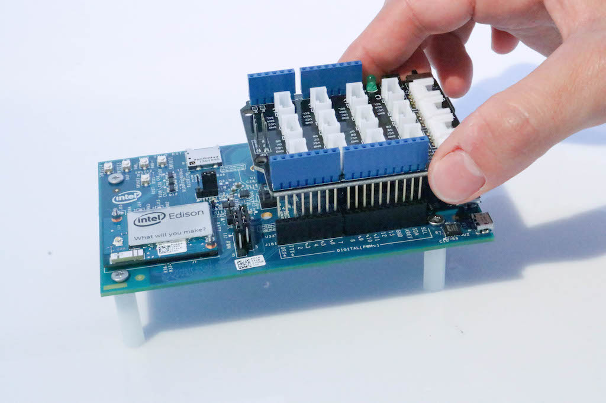

# Intel® Edison and the Industrial IoT Starter Kit  (Python Edition)

## Introduction

This document details all the necessary steps required to make use of the [Intel® Edison](http://www.intel.com/content/www/us/en/do-it-yourself/edison.html) as a sensor node with the **Industrial IoT Starter Kit**.

This document refers **only** to using **Python** on the Edison. See [here](https://github.com/relayr/edison/blob/master/arduino/README_Industrial_IoT_Starter_Kit.md) for using Arduino instead.

## Requirements

The following hardware is required:

* [Cisco 809 Industrial Integrated Services Router](http://www.cisco.com/c/en/us/products/routers/809-industrial-router/index.html)
* [Intel Edison Arduino breakout kit](https://www.iot-starterkit.de/fileadmin/media/pdf/iot/edisonarduino_hg_331191007_2.pdf)
* [Seeedstudio Grove Base Shield](http://wiki.seeedstudio.com/wiki/Grove_-_Base_shield_v2)
* Seeedstudio Sensor Kit
* Wireless Access Point (that is part of the same local network, so the Edison can connect via WiFi)
* Network Switch (to connect the Cisco 809 and the Wireless Access Point)

A computer is required to connect to the Edison board for flashing and configuring.

## Installation & configuration

### Setting up the hardware

Assemble the Arduino Expansion Board found in your Industrial IoT Starter Kit according to the directions in the [Intel Edison guide](https://software.intel.com/en-us/node/628221).

After that, plug the Grove Base Shield onto your Arduino Expansion Board as shown below, and you'll be ready to go:



### Setting up the firmware

To flash the latest firmware on the Edison board, use the *Intel® Edison Board Configuration Tool*
([Mac OS X](https://software.intel.com/en-us/get-started-edison-osx-step2), [Linux](https://software.intel.com/en-us/get-started-edison-linux-step2), [Windows](https://software.intel.com/en-us/get-started-edison-windows-step2)). The official firmware is an operating system provided by the [Yocto Project](https://www.yoctoproject.org/), which is a Linux flavor geared towards embedded systems.

The setup wizard will guide you through the firmware flashing process, SSH configuration and WiFi configuration. Start with flashing the firmware and continue with SSH and WiFi configuration. When a step is completed, a green checkmark is shown next to the setup options in the wizard.


### Connecting your personal computer with the Intel Edison

When done with firmware flashing and the basic configurations of the Edison board, we can SSH into Intel Edison board and do further configurations by using its Linux shell. The Edison's IP address is found in the WiFi section of the **Intel Edison Board Configuration Tool**.

Alternatively, we can find the IP address of the board **without** the Intel configuration wizard by using any of the following methods:

 1. Log in to your router/access point and find the IP address assigned to the Edison board.
 2. Set up [mDNS](http://www.multicastdns.org/) on your Intel Edison.
 3. Set up the board using a **static** IP.
 4. Find the IP address of the board using a scanner such as [`nmap`](https://nmap.org/).

Once we know the IP of the Intel Edison board we can execute the following command which will log us in the Edison board using SSH:

```shell
ssh root@<edison's-IP-address>
```

When prompted for a password use the one that was set in the security settings of the Intel Edison Board Configuration Tool. If everything worked properly, we should now be logged in to the board as **root**.

### Clone the git repository

Once you are logged in the Intel Edison and are able to interact with its Linux shell, you can clone the git repository by executing the following command:

```shell
git clone https://github.com/relayr/edison
```

From then on you can find the folder with the Python code examples `~/edison/python/examples` of the Edison board. However, before running any of them we first have to install all the necessary libraries and Python dependencies.

### Setting up the `libmraa` library

The default firmware (Linux Yocto image)
comes with Python 2.7 already installed, so you could start running
scripts right away. However, if you wish to interact with the GPIOs of
the Intel Edison breakout board, you'll have to install
the [`libmraa`](https://github.com/intel-iot-devkit/mraa) C/C++ library,
which provides bindings for Java, JavaScript and Python. As noted in
the linked Github repository, you can install it through the 
[OPKG package manager](https://wiki.openwrt.org/doc/techref/opkg) by
executing the following three commands in the Linux shell of the Edison board:

```shell
echo 'src mraa-upm http://iotdk.intel.com/repos/3.5/intelgalactic/opkg/i586' > /etc/opkg/mraa-upm.conf
opkg update
opkg install mraa
```

The first line adds the source of the `libmraa` repository to the
package manager source list, the second one updates the existing
[opkg](https://en.wikipedia.org/wiki/Opkg) packages, and the last one
installs the `libmraa` package.

### Python Dependencies

The next step is to install the needed Python dependencies for running the examples on the Edison board. 

**NOTE:** When dealing with Python dependencies and versions, it is good practice
to create an isolated Python environment for each application we are
running. 

#### Virtualenv

`virtualenv` is a tool for creating and managing isolated Python
environments. It's installed using the `pip` Python package
manager.

```shell
pip install virtualenv
```

Once installed, we can create an isolated environment wherever we
want. Let's move (`cd`) into our code repository and create an environment called `ENV`.

```shell
cd ~/edison/
virtualenv --system-site-packages ENV
```

The `--system-site-packages` flag is used to inherit all of the packages from the global site-packages directory. Because we need to use the `libmraa` Python bindings, which we previously installed globally, it is necessary to use the `--system-site-packages` flag.

To activate the environment, first navigate to `ENV`, inside the current directory:

```shell
cd ENV
```

Once there, simply run:

```shell
source bin/activate
```

You will notice the `(ENV)` prefix appearing in your command-line interface, which indicates that you are in an isolated Python environment called `ENV`.

Now we can use `pip` package manager and the Python interpreter just as we normally would. However, additional Python packages will be installed **only** in the virtual environment.

To deactivate the virtual environment, run the following shell command:

```shell
deactivate
``` 

If you encounter any issues when using `virtualenv`, consult the [official
documentation](https://virtualenv.pypa.io/en/stable/).

####Paho MQTT

In order to run the Python examples provided in this repository, we need to install the [`paho-mqtt`](https://pypi.python.org/pypi/paho-mqtt/1.1) package,
which provides a MQTT client library and enables sending/receiving of messages to/from a MQTT broker. [MQTT](https://en.wikipedia.org/wiki/MQTT) is a lightweight messaging protocol built on top of TCP/IP. We chose it for exchanging messages between the gateway and the Edison board because of its simplicity and low overhead.

To install `paho-mqtt`  with `pip`, run:

```shell
pip install paho-mqtt
```

Once installed, we can use `paho-mqtt` classes by importing the module into our script, as we will see later in our code examples.

To learn more about the functionalities of the `paho-mqtt` Python client, see the
[official documentation](https://pypi.python.org/pypi/paho-mqtt/1.1).

After finishing all the installation and configuration steps, we are now ready to make use of MQTT and run the code examples.

## Code Examples

The code examples below will get you started with using Intel® Edison board as a sensor node.

We will need a representation of our Intel Edison board in the relayr Cloud. Through this entity we will manage sent/received data, MQTT credentials and UI interface of the relayr Dashboard. To create a device on relayr Dashboard follow the [**Devices Guide**](http://docs.relayr.io/getting-started/devices-guide/) and select the **Intel Edison (Industrial IoT Starter Kit)** as a *Device Model*.

Once you've added your device to the relayr cloud, you are ready to run the first example.

### Example 1 (`blink.py`)

The `blink.py` example is a *Hello world* script which will toggle the LED on
the Edison board every 0.5 seconds. We will run it mostly to test if `libmraa`
has been installed properly and to interact with the GPIOs of your Edison
board.

To run the Python code example, execute the following command in the Intel Edison Linux shell:

```shell
python path/to/blink.py
```

If the `libmraa` version was printed in your terminal and the LED on the board
started blinking, then you can move on to the next example, in which we will
connect a motion sensor to the Edison board. If the code example failed to
execute without errors, then the problem is most likely related to the
installation of the `libmraa` library. Review the `libmraa` installation
instruction in the previous section of this document and consult the official
[documentation](https://github.com/intel-iot-devkit/mraa) for troubleshooting.

### Example 2 (`motion_sensor.py`)

The `motion_sensor.py` example uses a PIR motion sensor to detect movements in
its proximity. The sensor outputs a digital value (*HIGH* if there is movement,
*LOW* if there is no movement) that is then sent to the Vertex-enabled gateway and
the relayr cloud.

First, prepare the hardware by connecting the *PIR motion sensor* to the **Digital Pin 2 (D2)**.


Next, modify the `motion_sensor.py` Python script with the MQTT credentials of
the device you've created on the relayr Dashboard. You can use the `nano
path/to/motion_sensor.py` command to open the script in the nano editor.
Change the following part of the code:

```python
# MQTT credentials.
mqtt_credentials = {
    "user": "<your user ID>",
    "password": "<your password>",
    "clientId": "<your client ID>",
    "topic": "<your MQTT topic>"
}
```

and save the changes by pressing `Control` + `X` and confirming the command with `Y`.

Now you are ready to execute the Python script by using the following command:

```shell
python path/to/motion_sensor.py
```

You should see a message in your terminal when the MQTT client running on the
Edison connects to the MQTT broker in the Vertex-enabled gateway. If the connection is
successful and everything is working properly, then a JSON schema of
`{'meaning': 'motion', 'value': True}` will be sent every 0.5 seconds to the
Vertex-enabled gateway and from there to the relayr cloud. The value of the `value`
property will change according to the motion detected by the PIR sensor. You
can observe the changes on the relayr Dashboard.

If you run into problems, make sure that you have all the Python dependencies
installed (`libmraa` and `paho-mqtt`) and that your virtual Python environment
is activated (if you are using one.)

### Example 3 (`buzzer.py`)

The `buzzer.py` example shows you how to receive commands from the relayr
Cloud and/or the Vertex-enabled gateway. The command received by Intel Edison will
remotely turn on or off a piezo buzzer.

First prepare the hardware by connecting the [grove
buzzer](http://wiki.seeedstudio.com/wiki/Grove_-_Buzzer) to the **Digital pin
5 (D5)**.


As in the `motion.py` example, paste the device's credentials from the relayr Dashboard into the appropriate place of the `buzzer.py`.

```python
# MQTT credentials.
mqtt_credentials = {
    "user": "<your user ID>",
    "password": "<your password>",
    "clientId": "<your client ID>",
    "topic": "<your MQTT topic>"
}
```

Run the code example by executing the following Linux shell command:

```shell
python path/to/buzzer.py
```

Now the Intel Edison is listening to the messages from the relayr cloud. You
can control the buzzer by pressing **True** or **False** in the **buzzer**
widget on the relayr Dashboard. If you set it up correctly, you'll hear a
buzzing sound.


### Example 4 (`multi_sensor.py`)

The `multi_sensor.py` example uses the following sensors and actuators: PIR
motion sensor, luminosity sensor, water sensor and a buzzer. You mustconnect
all of these sensors and actuators in order for this example to work
correctly. Here is a list of pins you should use:

* PIR motion sensor - **D2**
* Buzzer - **D5**
* Luminosity sensor - **A0**
* Water sensor - **D3**

As in the previous examples, you must add your MQTT credentials in the appropriate place in the `multi_sensor.py` code example and then run the script by executing the following shell command:

```shell
python path/to/multi_sensor.py
```

From then on, your device will publish sensor data every 0.5 seconds to the
relayr cloud. You can see the incoming data on the relayr Dashboard and
trigger a sound by pressing *True* in the *buzzer* widget.

### Starting scripts automatically at system start-up

This section will guide you through the configuration of the Intel Edison to
trigger a Python script on boot so that you can start sending data as soon as
you power on your board.

We will use
[`systemd`](https://www.freedesktop.org/software/systemd/man/systemd.html#), a
system and service manager for Linux operating system, while creating a new
service responsible for monitoring and sending sensor data. You can find a
`mote.service` service configuration file in the `edison/python/autostart/`
directory.

If you open this configuration, you'll see a simple `systemd` unit definition
triggering a `mote` shell script.

```text
[Unit]
Description=Sensor Monitoring Service
Wants=network-online.target
After=network-online.target

[Service]
ExecStart=/home/root/edison/python/autostart/mote
Restart=on-failure
RestartSec=10

[Install]
WantedBy=multi-user.target
```

Mote shell script is also in the `edison/python/autostart/` and contains only two commands:

```shell
source /home/root/edison/ENV/bin/activate
python /home/root/edison/python/examples/multi_sensor.py
```

The first one activates a Python virtual environment with the name `ENV` in the code repository folder, while the second one runs the `multi_sensor.py` script in the examples folder. Adjust these paths to the locations of the virtual environment (if you use one) and the Python script you wish to run at system startup.

Next, make the `mote` shell script executable by utilizing the following
command:

```shell
chmod +x edison/python/autostart/mote
```

You can test if the shell script has the right permissions and works properly
by executing:

```shell
./edison/python/autostart/mote
```

If everything is fine and the Python script is being triggered, you can kill
the process and move on to copying `mote.service` to the
`/lib/systemd/system/` folder:

```shell
cp edison/python/autostart/mote.service /lib/systemd/system/
```

Once the service configuration file is in the proper `systemd` folder, we have
to change its permissions:

```shell
chmod 644 /lib/systemd/system/mote.service
```

Now everything is ready and you can reload all the `systemd` configurations...

```shell
systemctl daemon-reload
```

...and enable the service with:

```shell
systemctl enable mote.service
```

From now on, when restarting the Edison board, the `multi_sensor.py` script
should start automatically. You can use `systemctl stop mote.service` to stop
the `mote.service` and `systemctl disable mote.service` to remove it from the
list of services that start on system startup. For troubleshooting and/or more
advanced service configurations, [consult the documentation](https://www.freedesktop.org/software/systemd/man/systemd.html#).

# Further Steps

To explore further and write your own Python code for sensors of your choice,
examine the code examples and their comments. Furthermore, you can browse
the [UPM Python library](http://iotdk.intel.com/docs/master/upm/python/) and
its [sensor code example list](https://github.com/intel-iot-devkit/upm/tree/master/examples/python).

## License

Copyright (C) 2016 relayr GmbH, Klemen Lilija <klemen@relayr.io>, Brian Lemke <brian@relayr.io>, Antonio Almeida <antonio@relayr.io>

Permission is hereby granted, free of charge, to any person obtaining a copy of this software and associated documentation files (the "Software"), to deal in the Software without restriction, including without limitation the rights to use, copy, modify, merge, publish, distribute, sublicense, and/or sell copies of the Software, and to permit persons to whom the Software is furnished to do so, subject to the following conditions:

The above copyright notice and this permission notice shall be included in all copies or substantial portions of the Software.

Except as contained in this notice, the name(s) of the above copyright holders shall not be used in advertising or otherwise to promote the sale, use or other dealings in this Software without prior written authorization.

THE SOFTWARE IS PROVIDED "AS IS," WITHOUT WARRANTY OF ANY KIND, EXPRESS OR IMPLIED, INCLUDING BUT NOT LIMITED TO THE WARRANTIES OF MERCHANTABILITY, FITNESS FOR A PARTICULAR PURPOSE AND NONINFRINGEMENT.  IN NO EVENT SHALL THE AUTHORS OR COPYRIGHT HOLDERS BE LIABLE FOR ANY CLAIM, DAMAGES OR OTHER LIABILITY, WHETHER IN AN ACTION OF CONTRACT, TORT OR OTHERWISE, ARISING FROM, OUT OF OR IN CONNECTION WITH THE SOFTWARE OR THE USE OR OTHER DEALINGS IN THE SOFTWARE.